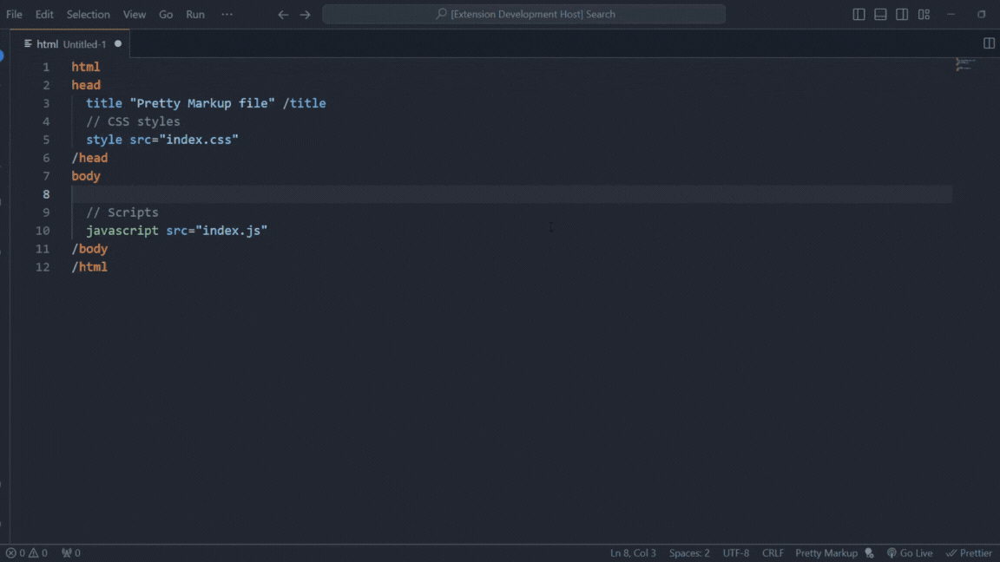

## Pretty Markup: Write HTML Like Poetry (But for the Web!)

Imagine crafting elegant, semantic HTML structures without the clutter of angle brackets. Pretty Markup, a revolutionary preprocessor like Sass for CSS or TypeScript for JavaScript, Pretty Markup takes HTML to the next level.

**But how?**

* **Goodbye `< >`, Hello Readability:** Pretty Markup reimagines HTML syntax, potentially using a more natural language-like approach. This could make writing HTML a breeze, boosting developer productivity.
* **Semantic Powerhouse:**  Focus on the meaning of your content, not just its presentation. Pretty Markup encourage semantic best practices, ensuring your HTML is not only beautiful but also machine-readable.
* **A Superset of HTML?**  Think of it as a layer on top of regular HTML. Write clean, concise code in Pretty Markup, and it seamlessly translates into standard, browser-compatible HTML under the hood. It represents a potential future where writing HTML is an expressive and enjoyable experience.



# Get started 🤔
To start developing with Pretty Markup, create a folder called __src__ at the root of your project. After that, just start creating your pretty files with the extension `.pm`.

```bash
  index.pm
```

# Compile ⚙️
To compile with CLI you can install it globally.

## Official syntax highlighter ❤️‍🔥
- Pretty Markup Language Basics is available to installation on vscode [VS code]("https://code.visualstudio.com/") you can search for `Pretty Markup` and install the extension.

```bash
ext install mopires.pretty-markup
```

## How to Contribute 🙏🏻
We welcome contributions! Please see our [CONTRIBUTING.md](CONTRIBUTING.md) for details on how you can help improve the project.

## Issues and improvements 🔧
Report bugs or improvements at https://github.com/mopires/pretty-markup/issues

## License ⚖️
This project is licensed under the [MIT License](LICENSE.txt).